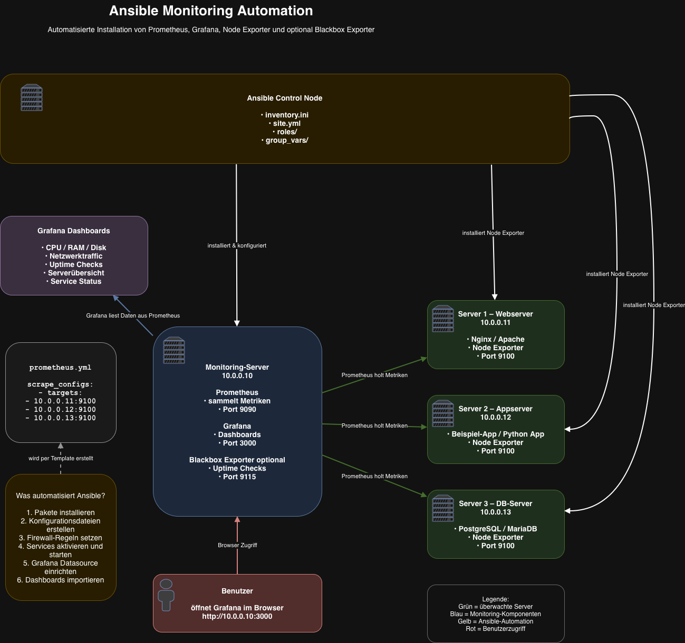

# Automatisierte Server- und Monitoring-Umgebung mit Ansible

## 1. Projektübersicht

In diesem Projekt wird mit Ansible eine automatisierte Server- und Monitoring-Umgebung aufgebaut. Die Umgebung besteht aus vier Linux-Servern mit unterschiedlichen Aufgaben:

- `web-server`
- `app-server`
- `db-server`
- `monitoring-server`

Die virtuelle Testumgebung wird mit Vagrant erstellt. Unterstützt werden Parallels Desktop, VirtualBox sowie VMware Fusion beziehungsweise VMware Workstation.

Ansible übernimmt anschliessend die Installation und Konfiguration der gesamten Umgebung. Dazu gehören Nginx, eine Python-Webapplikation, MariaDB, Prometheus, Grafana und Node Exporter.

Ziel ist eine reproduzierbare, automatisierte und möglichst einfach ausführbare Bereitstellung der gesamten Umgebung.

---

## 2. Ziel des Projektes

Folgende Komponenten werden automatisch installiert und konfiguriert:

- Nginx als Reverse Proxy
- Python-Webapplikation mit Flask
- Gunicorn als Application Server
- MariaDB als Datenbank
- Prometheus zur Sammlung von Metriken
- Grafana zur Visualisierung
- Node Exporter auf allen Servern
- Grafana-Datenquelle für Prometheus
- Grafana-Dashboard für Node-Exporter-Metriken
- systemd-Services für die Anwendungen

---

## 3. Architektur

| Server | Aufgabe | Hauptkomponenten |
|---|---|---|
| `web-server` | Einstiegspunkt für die Webapplikation | Nginx, Node Exporter |
| `app-server` | Ausführung der Webapplikation | Python, Flask, Gunicorn, Node Exporter |
| `db-server` | Speicherung der Applikationsdaten | MariaDB, Node Exporter |
| `monitoring-server` | Überwachung und Visualisierung | Prometheus, Grafana, Node Exporter |

```text
Benutzer
   |
   | HTTP Port 80
   v
web-server
Nginx Reverse Proxy
   |
   | HTTP Port 5000
   v
app-server
Python / Flask / Gunicorn
   |
   | MariaDB Port 3306
   v
db-server
MariaDB

monitoring-server
Prometheus + Grafana
   |
   | Node-Exporter-Metriken auf Port 9100
   |
   +------> web-server
   +------> app-server
   +------> db-server
   +------> monitoring-server
```

---

## 4. Komponenten

### 4.1 Webserver

Der `web-server` stellt den Einstiegspunkt für die Webapplikation dar.

Nginx nimmt HTTP-Anfragen entgegen und leitet diese als Reverse Proxy an die Python-Webapplikation auf dem `app-server` weiter.

```text
Browser
   |
   v
Nginx auf web-server
   |
   v
Flask/Gunicorn auf app-server:5000
```

### 4.2 Applikationsserver

Auf dem `app-server` läuft eine Python-Webapplikation mit Flask und Gunicorn.

Die Anwendung stellt folgende Endpunkte bereit:

| Endpunkt | Funktion |
|---|---|
| `/` | Startseite |
| `/health` | Prüft den Zustand der Applikation |
| `/db` | Prüft die Verbindung zur MariaDB-Datenbank |

Die Anwendung läuft auf Port `5000` und wird über einen systemd-Service gestartet.

### 4.3 Datenbankserver

Auf dem `db-server` wird MariaDB installiert.

Ansible erstellt automatisch:

- die Datenbank `appdb`
- den Benutzer `appuser`
- das konfigurierte Passwort
- die erforderlichen Datenbankberechtigungen
- die Konfiguration für externe Verbindungen

Für eine produktive Umgebung sollte das Passwort später mit Ansible Vault geschützt werden.

### 4.4 Monitoring-Server

Auf dem `monitoring-server` werden Prometheus und Grafana installiert.

Prometheus ist erreichbar unter:

```text
http://<MONITORING-IP>:9090
```

Grafana ist erreichbar unter:

```text
http://<MONITORING-IP>:3000
```

Grafana verwendet Prometheus als automatisch provisionierte Datenquelle.

---

## 5. Node Exporter

Node Exporter wird auf allen vier Servern installiert und liefert unter anderem folgende Metriken:

- CPU-Auslastung
- RAM-Verbrauch
- Festplattenbelegung
- Netzwerkverkehr
- Uptime
- Load Average
- Dateisysteminformationen
- Prozessinformationen

Die Metriken sind auf jedem Server verfügbar unter:

```text
http://<SERVER-IP>:9100/metrics
```

---

## 6. Datenfluss

### Webapplikation

```text
Benutzer
   |
   v
Nginx auf web-server
   |
   v
Flask/Gunicorn auf app-server
   |
   v
MariaDB auf db-server
```

### Monitoring

```text
Node Exporter auf allen Servern
   |
   v
Prometheus
   |
   v
Grafana
   |
   v
Dashboard im Webbrowser
```

---

## 7. Automatisierung mit Ansible

Ansible automatisiert:

- allgemeine Systemvorbereitung
- Installation von Nginx
- Konfiguration des Reverse Proxys
- Installation von Python
- Erstellung einer Python Virtual Environment
- Installation von Flask und Gunicorn
- Bereitstellung der Webapplikation
- Erstellung des systemd-Services
- Installation und Konfiguration von MariaDB
- Erstellung von Datenbank und Benutzer
- Installation von Node Exporter
- Installation und Konfiguration von Prometheus
- Erstellung der Prometheus-Targets
- Installation und Konfiguration von Grafana
- Provisionierung der Prometheus-Datenquelle
- Bereitstellung des Grafana-Dashboards
- Aktivierung und Start aller Services

---

## 8. Projektstruktur

```text
Ansible-based-Server-Monitoring-Deployment/
├── README.md
├── start-lab.sh
├── start-vagrant-only.sh
├── prepare-ansible-server.sh
├── deploy-from-ansible-server.sh
├── images/
│   └── ansible-automation.png
├── vagrant/
│   └── Vagrantfile
└── ansible/
    ├── ansible.cfg
    ├── site.yml
    ├── inventory/
    │   └── hosts.ini
    ├── group_vars/
    │   └── all.yml
    └── roles/
        ├── common/
        ├── nginx/
        ├── app/
        ├── mariadb/
        ├── node_exporter/
        ├── prometheus/
        └── grafana/
```

---

## 9. Ansible-Konfiguration

Datei:

```text
ansible/ansible.cfg
```

```ini
[defaults]
inventory = inventory/hosts.ini
host_key_checking = False
retry_files_enabled = False
roles_path = roles
stdout_callback = default
result_format = yaml

[ssh_connection]
pipelining = True
```

---

## 10. Globale Variablen

Datei:

```text
ansible/group_vars/all.yml
```

```yaml
---
app_name: ansible-monitoring-app
app_user: appuser
app_group: appuser
app_dir: /opt/ansible-monitoring-app
app_port: 5000

app_db_name: appdb
app_db_user: appuser
app_db_password: apppassword

web_server_ip: "{{ hostvars[groups['web'][0]].ansible_host }}"
app_server_ip: "{{ hostvars[groups['app'][0]].ansible_host }}"
db_server_ip: "{{ hostvars[groups['db'][0]].ansible_host }}"
monitoring_server_ip: "{{ hostvars[groups['monitoring'][0]].ansible_host }}"

app_host: "{{ app_server_ip }}"
app_db_host: "{{ db_server_ip }}"
```

Die IP-Adressen werden dynamisch aus dem Inventory übernommen und müssen nicht fest in dieser Datei eingetragen werden.

---

## 11. Inventory

Das Inventory wird durch die Bash-Scripts automatisch erstellt.

```ini
[web]
web-server ansible_host=10.211.55.35

[app]
app-server ansible_host=10.211.55.33

[db]
db-server ansible_host=10.211.55.34

[monitoring]
monitoring-server ansible_host=10.211.55.32

[all:vars]
ansible_user=vagrant
ansible_python_interpreter=/usr/bin/python3
```

Empfohlene `.gitignore`-Einträge:

```gitignore
ansible/inventory/hosts.ini
.vagrant/
```

---

## 12. Ansible-Rollen

### `common`

Installiert allgemeine Pakete:

- curl
- wget
- vim
- htop
- net-tools
- ca-certificates
- gnupg
- lsb-release
- software-properties-common

### `nginx`

Installiert Nginx und erstellt die Reverse-Proxy-Konfiguration.

### `app`

Installiert und konfiguriert:

- Python
- Virtual Environment
- Flask
- Gunicorn
- Applikationsdateien
- systemd-Service

### `mariadb`

Installiert MariaDB und erstellt Datenbank sowie Benutzer.

Verwendete Collection:

```text
ansible.mysql
```

### `node_exporter`

Installiert Node Exporter auf allen Servern.

### `prometheus`

Installiert Prometheus und erstellt die Target-Konfiguration.

### `grafana`

Installiert Grafana und provisioniert:

- Prometheus-Datenquelle
- Dashboard-Verzeichnis
- Dashboard-Provider
- Node-Exporter-Dashboard

---

## 13. Zentrales Playbook

Datei:

```text
ansible/site.yml
```

```yaml
---
- name: Configure all servers
  hosts: all
  become: true
  roles:
    - common
    - node_exporter

- name: Configure web server
  hosts: web
  become: true
  roles:
    - nginx

- name: Configure application server
  hosts: app
  become: true
  roles:
    - app

- name: Configure database server
  hosts: db
  become: true
  roles:
    - mariadb

- name: Configure monitoring server
  hosts: monitoring
  become: true
  roles:
    - prometheus
    - grafana
```

---

## 14. Lokale Komplettausführung

Das Script `start-lab.sh` führt lokal die vollständige Installation aus.

Es übernimmt:

1. Auswahl des Virtualisierungsanbieters
2. Start der Vagrant-VMs
3. Ermittlung der IP-Adressen
4. Ermittlung der Vagrant-SSH-Keys
5. Erstellung des Inventory
6. Installation der Ansible-Collection
7. Syntaxprüfung
8. Verbindungstest
9. Ausführung des Playbooks
10. Prüfung der Services

```bash
chmod +x start-lab.sh
./start-lab.sh
```

Das Script wird ohne `sudo` gestartet.

---

## 15. Unterstützte Virtualisierungsanbieter

| Anbieter | Provider |
|---|---|
| Parallels Desktop | `parallels` |
| VirtualBox | `virtualbox` |
| VMware | `vmware_desktop` |

Vor einem Providerwechsel:

```bash
cd vagrant
vagrant destroy -f
```

---

## 16. Getrennte Ausführung mit Ansible-Server

Der getrennte Ablauf besteht aus drei Scripts.

### 16.1 `prepare-ansible-server.sh`

Wird auf dem Ansible-Server ausgeführt.

Aufgaben:

- `apt update`
- `apt upgrade`
- Installation von Git, Ansible, Python und SSH
- Erstellung eines SSH-Schlüsselpaares

Key-Pfade:

```text
~/.ssh/ansible_lab
~/.ssh/ansible_lab.pub
```

Ausführung:

```bash
chmod +x prepare-ansible-server.sh
sudo ./prepare-ansible-server.sh
```

### 16.2 `start-vagrant-only.sh`

Wird auf dem lokalen Computer ausgeführt.

Aufgaben:

- Auswahl des Providers
- Download des öffentlichen Keys vom Ansible-Server
- Erstellung der vier VMs
- Installation des öffentlichen Keys auf allen VMs
- Ausgabe der IP-Adressen

Es führt kein Playbook aus.

```bash
chmod +x start-vagrant-only.sh
./start-vagrant-only.sh
```

### 16.3 `deploy-from-ansible-server.sh`

Wird auf dem Ansible-Server ausgeführt.

Aufgaben:

- Klonen oder Aktualisieren des Repositorys über HTTPS
- Abfrage der vier VM-IP-Adressen
- Erstellung des Inventory
- Installation von `ansible.mysql`
- Syntaxprüfung
- SSH-Verbindungstest
- Ausführung des Playbooks
- Prüfung der Services

Repository:

```text
https://github.com/bromag/Ansible-based-Server-Monitoring-Deployment.git
```

Ausführung:

```bash
chmod +x deploy-from-ansible-server.sh
sudo ./deploy-from-ansible-server.sh
```

---

## 17. Reihenfolge bei getrennter Ausführung

### Schritt 1

Auf dem Ansible-Server:

```bash
sudo ./prepare-ansible-server.sh
```

### Schritt 2

Auf dem lokalen Computer:

```bash
./start-vagrant-only.sh
```

### Schritt 3

Auf dem Ansible-Server:

```bash
sudo ./deploy-from-ansible-server.sh
```

---

## 18. Netzwerkvoraussetzungen

Der Ansible-Server muss die vier VMs erreichen können.

```bash
ping <VM-IP>
```

SSH-Test:

```bash
ssh -i ~/.ssh/ansible_lab vagrant@<VM-IP>
```

Bei Host-only-Netzwerken auf einem anderen Computer kann der Zugriff blockiert sein. Mögliche Lösungen:

- Bridged Networking
- Routing
- Ansible-Server im gleichen Netzwerk
- lokale Ausführung von Ansible

---

## 19. SSH-Authentifizierung

Privater Key auf dem Ansible-Server:

```text
~/.ssh/ansible_lab
```

Öffentlicher Key auf den VMs:

```text
/home/vagrant/.ssh/authorized_keys
```

Der private Key darf nicht in Git gespeichert werden.

---

## 20. Manuelle Tests

```bash
cd ansible
ansible-inventory --graph
ansible all -m ping
ansible-playbook site.yml --syntax-check
ansible-playbook site.yml
```

---

## 21. Service-Prüfungen

```bash
ansible web-server -b -m command -a "systemctl is-active nginx"
ansible app-server -b -m command -a "systemctl is-active python-app"
ansible db-server -b -m command -a "systemctl is-active mariadb"
ansible monitoring-server -b -m command -a "systemctl is-active prometheus"
ansible monitoring-server -b -m command -a "systemctl is-active grafana-server"
```

Erwartete Antwort:

```text
active
```

---

## 22. Funktionstests

```bash
curl http://<WEB-SERVER-IP>/
curl http://<WEB-SERVER-IP>/health
curl http://<WEB-SERVER-IP>/db
curl http://<SERVER-IP>:9100/metrics
```

Prometheus:

```text
http://<MONITORING-IP>:9090
```

Grafana:

```text
http://<MONITORING-IP>:3000
```

---

## 23. Idempotenz

Das Playbook kann mehrfach ausgeführt werden:

```bash
ansible-playbook site.yml
```

Statuswerte:

```text
ok
changed
skipped
failed
```

---

## 24. Ansible-Lint

```bash
ansible-lint
```

Beispielmeldung:

```text
No new line character at the end of file
```

VS-Code-Einstellung:

```json
"files.insertFinalNewline": true
```

---

## 25. Ansible-Collection

```bash
ansible-galaxy collection install ansible.mysql
```

Verwendete Module:

```yaml
ansible.mysql.mysql_db:
ansible.mysql.mysql_user:
```

---

## 26. Sicherheit

Umgesetzte Massnahmen:

- SSH-Key-Authentifizierung
- privater Key bleibt auf dem Ansible-Server
- nur der öffentliche Key wird verteilt
- `.vagrant/` wird nicht versioniert
- Services laufen mit eigenen Benutzern
- separater MariaDB-Benutzer

Mögliche Erweiterungen:

- Ansible Vault
- Firewall-Regeln
- HTTPS
- Backups
- zentrales Logging
- stärkere Passwörter

---

## 27. Mögliche Erweiterungen

- Blackbox Exporter
- Alertmanager
- Firewall-Automatisierung
- Ansible Vault
- eigene Grafana-Dashboards
- Backup-Automatisierung
- Benachrichtigungen

---

## 28. Herausforderungen

### Dynamische IP-Adressen

Die IP-Adressen werden automatisch ausgelesen und in das Inventory geschrieben.

### Netzwerk unter Parallels

Da die statische Zusatzschnittstelle nicht zuverlässig aktiv war, werden DHCP-Adressen verwendet.

### SSH-Keys

Lokal werden Vagrant-Keys verwendet. Beim getrennten Ablauf wird ein gemeinsamer Ansible-Key verteilt.

### Grafana-Provisionierung

Nach Problemen mit einem eigenen Dashboard wurde wieder das funktionierende Standard-Dashboard verwendet.

### MySQL-Module

`community.mysql` wurde durch `ansible.mysql` ersetzt.

---

## 29. Aktueller Projektstand

Erfolgreich umgesetzt:

- vier Vagrant-VMs
- Providerwahl
- dynamische IP-Ermittlung
- automatisches Inventory
- Nginx Reverse Proxy
- Python-Webapplikation
- MariaDB
- Node Exporter
- Prometheus
- Grafana
- Grafana-Dashboard
- lokale Komplettausführung
- getrennter Ablauf mit Ansible-Server
- gemeinsamer SSH-Key
- automatische Service-Prüfungen

---

## 30. Fazit

Mit dem Projekt wurde eine vollständige Server- und Monitoring-Umgebung automatisiert aufgebaut.

Vagrant übernimmt die Erstellung der virtuellen Maschinen. Ansible installiert und konfiguriert die benötigten Dienste. Prometheus und Grafana ermöglichen die zentrale Überwachung aller Server.

Durch die Rollenstruktur bleibt das Projekt übersichtlich, reproduzierbar und erweiterbar.

---

## Architekturdiagramm


