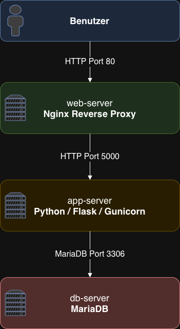
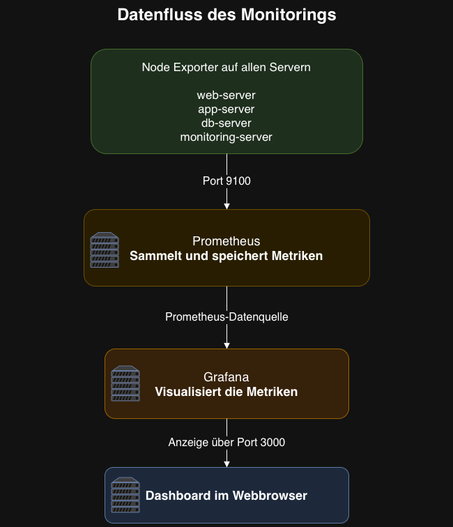

# Automatisierte Server- und Monitoring-Umgebung mit Ansible

## 1. Projektübersicht und Ziel

In diesem Projekt wurde eine vollständige Server- und Monitoring-Umgebung automatisiert aufgebaut.

Die virtuellen Maschinen werden mit Vagrant erstellt. Anschliessend übernimmt Ansible die Installation und Konfiguration aller benötigten Dienste.

### Gesamtarchitektur


Das Diagramm zeigt die gesamte Projektarchitektur. Vagrant erstellt die vier virtuellen Maschinen, während Ansible die benötigten Dienste installiert und konfiguriert. Der `web-server` leitet Anfragen an den `app-server` weiter, der wiederum mit dem `db-server` kommuniziert. Der `monitoring-server` sammelt die Systemmetriken aller Server und stellt sie in Grafana dar.

Die Umgebung besteht aus vier Linux-Servern:

| Server | Aufgabe | Komponenten |
|---|---|---|
| `web-server` | Einstiegspunkt der Webapplikation | Nginx, Node Exporter |
| `app-server` | Ausführung der Anwendung | Python, Flask, Gunicorn, Node Exporter |
| `db-server` | Speicherung der Anwendungsdaten | MariaDB, Node Exporter |
| `monitoring-server` | Überwachung und Visualisierung | Prometheus, Grafana, Node Exporter |

Ziel des Projektes ist eine automatisierte und reproduzierbare Testumgebung, die ohne manuelle Installation der einzelnen Dienste bereitgestellt werden kann.

---


## 2. Architektur Datenflüsse

### Datenfluss der Webapplikation

{ width=80% }

Das Diagramm zeigt den Datenfluss der Webapplikation. Der Benutzer greift über den Browser auf den `web-server` zu. Nginx nimmt die Anfrage auf Port 80 entgegen und leitet sie auf Port 5000 an die Python-Webapplikation auf dem `app-server` weiter. Benötigt die Anwendung Daten, verbindet sie sich über Port 3306 mit MariaDB auf dem `db-server`.

---


### Datenfluss des Monitorings



Das Diagramm zeigt den Datenfluss des Monitorings. Auf allen vier Servern ist Node Exporter installiert und stellt Systemmetriken auf Port 9100 bereit. Prometheus ruft diese Metriken regelmässig ab und speichert sie. Grafana verwendet Prometheus als Datenquelle und zeigt die gesammelten Informationen im Dashboard an.

---

## 3. Automatisierte Bereitstellung

Ansible übernimmt folgende Aufgaben:

- Vorbereitung der Linux-Server
- Installation und Konfiguration von Nginx
- Bereitstellung der Python-Webapplikation
- Installation von Flask und Gunicorn
- Erstellung eines systemd-Services
- Installation und Konfiguration von MariaDB
- Erstellung der Datenbank und des Datenbankbenutzers
- Installation von Node Exporter auf allen Servern
- Installation und Konfiguration von Prometheus
- Konfiguration der Prometheus-Targets
- Installation und Konfiguration von Grafana
- Einrichtung von Prometheus als Grafana-Datenquelle
- Bereitstellung des Grafana-Dashboards

Die Konfiguration wurde in folgende Ansible-Rollen aufgeteilt:

```text
common
nginx
app
mariadb
node_exporter
prometheus
grafana
```

---

## 4. Ausführung des Projektes

Die Umgebung kann auf zwei Arten gestartet werden.

### 4.1 Vollständige lokale Ausführung

Bei der lokalen Ausführung werden Vagrant und Ansible auf demselben Computer verwendet.

```bash
chmod +x start-lab.sh
./start-lab.sh
```

Das Script startet die VMs, ermittelt die IP-Adressen, erstellt das Inventory und führt das Ansible-Playbook aus.

Unterstützte Provider:

```text
1) Parallels Desktop
2) VirtualBox
3) VMware Fusion / Workstation
```

### 4.2 Ausführung mit separatem Ansible-Server

#### Schritt 1: Ansible-Server vorbereiten

```bash
chmod +x prepare-ansible-server.sh
sudo ./prepare-ansible-server.sh
```

Dabei werden die benötigten Programme installiert und folgende SSH-Keys erstellt:

```text
~/.ssh/ansible_lab
~/.ssh/ansible_lab.pub
```

#### Schritt 2: Vagrant-VMs erstellen

```bash
chmod +x start-vagrant-only.sh
./start-vagrant-only.sh
```

Das Script erstellt die vier VMs, lädt den öffentlichen SSH-Key vom Ansible-Server und installiert ihn auf allen VMs.

#### Schritt 3: Deployment starten

```bash
chmod +x deploy-from-ansible-server.sh
sudo ./deploy-from-ansible-server.sh
```

Das Script fragt die VM-IP-Adressen ab, erstellt das Inventory und führt das Deployment aus.

Nach erfolgreicher Ausführung werden folgende Adressen angezeigt:

```text
Webapplikation:
  http://<WEB-IP>

Prometheus:
  http://<MONITORING-IP>:9090

Grafana:
  http://<MONITORING-IP>:3000
```

---

## 5. Verwendung der Umgebung

### Webapplikation

```text
http://<WEB-SERVER-IP>
```

| Endpunkt | Funktion |
|---|---|
| `/` | Startseite |
| `/health` | Prüft den Zustand der Anwendung |
| `/db` | Prüft die Verbindung zur Datenbank |

### Prometheus

```text
http://<MONITORING-IP>:9090
```

Targets:

```text
http://<MONITORING-IP>:9090/targets
```

Alle Node-Exporter-Targets sollten den Status `UP` besitzen.

### Grafana

```text
http://<MONITORING-IP>:3000
```

Anmeldedaten:

```text
Benutzername: admin
Passwort: admin
```

Da es sich um eine Testumgebung handelt, kann die Aufforderung zur Passwortänderung mit **Skip** übersprungen werden.

Danach:

1. **Dashboards** öffnen
2. **Infrastructure** auswählen
3. **Node Exporter Full** öffnen
4. beim Filter **Job** `node_exporter` auswählen

Anschliessend werden die Metriken aller vier Server angezeigt.
